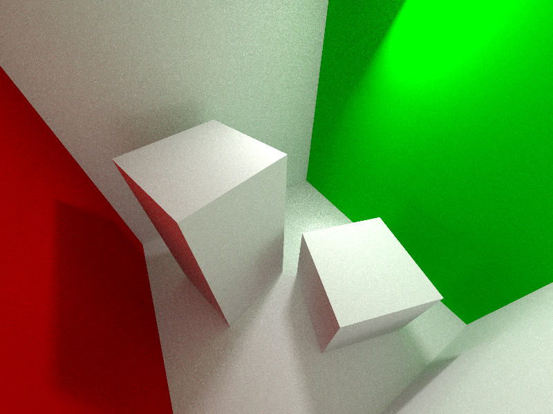
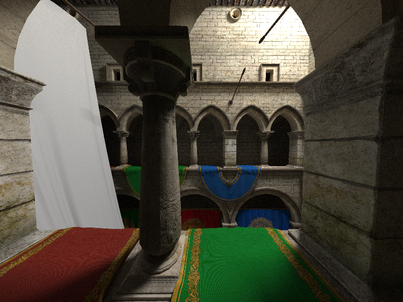

<h3>Tools & tech I've worked with</h3>

  
  
  
  
  
  
  
  
  
  
  
  

----

<h3>Some stuff I've developed</h3>

<h4>Monte Carlo path tracer</h4>

A unidirectional Monte Carlo path tracer with a Russian roulette termination scheme and tangent-space normal mapping. The underlying ray tracer was also largely developed from scratch, along with the employed acceleration structures, namely a bounding volume hierarchy. In addition, the ray-box intersection tests were accelerated using AVX instructions. This work is related to the Aalto University course *Advanced Computer Graphics*.

  
  

Figure 1: <a href="http://www.graphics.cornell.edu/online/box/">The Cornell Box</a> and <a href="https://www.cryengine.com/marketplace/product/crytek/sponza-sample-scene">Crytek Sponza</a> scenes rendered using the path tracer

<h4>Zhade</h4>

Zhade is a hobby project rasterization-based 3D renderer built with C++20 and modern (4.6) OpenGL. Currently, a forward renderer with batching and instancing is targeted, but support for deferred shading may also be included in the future. See the project repository [here](https://github.com/tatutimonen/Zhade).

<h4>See my other repositories for more!</h4>
